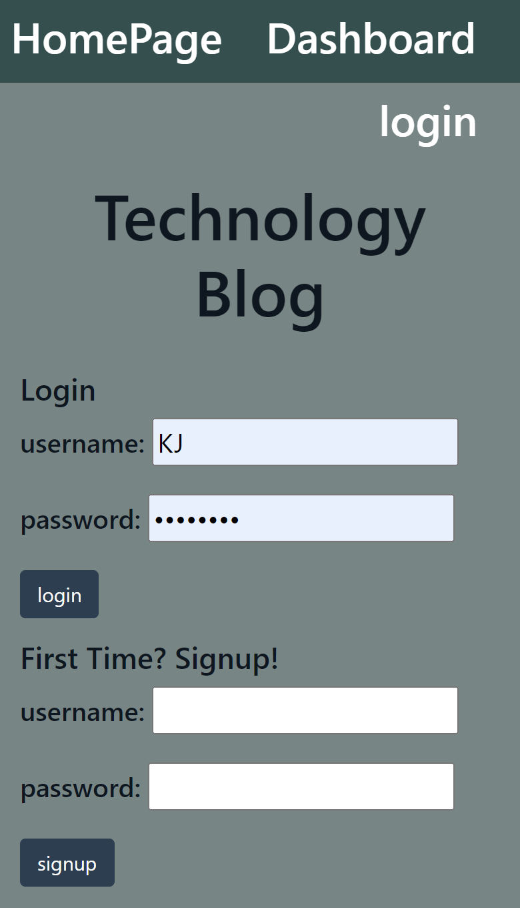

# Technology Blog 
   
  ===========================================
    
  ## Description 
      CMS style blogging app allowing users to view posts, and login to comment or create their own posts.  All posts and comments are stored in a SQL database and presented using handlebar templates. Express-session is used for authentication  
  ## Table of Contents 
  - [Installation](#installation)
  - [Usage](#usage)
  - [Contributions](#contributions)
  - [Tests](#tests)
  - [Questions](#questions)
  - [License](#license)
  ## Installation 
      Run an npm install in the repository directory in the control.  The following packages will also be used: express-handlebars, sequelize, dotenv, bcrypt, express-session, and connect-session-sequelize.  
  ## Usage 
      Once all packages are installed, create the database using MySQL, and then run npm start. Use locally at localhost//3001.  This app has also been deployed at 
[https://vast-forest-19866.herokuapp.com](https://vast-forest-19866.herokuapp.com).

  ## Contributions 
  This was created by:
* KellyJohnson364: [https://github.com/KellyJohnson364](https://github.com/KellyJohnson364)
            
            
            
         
           

   

## Questions 
If you have questions or feedback, please contact KellyJohnson364 at [https://github.com/KellyJohnson364](https://github.com/KellyJohnson364) or via email at KJ3641402@gmail.com.

## License
This project is licensed under MIT License.
For more info click [MIT License](./assets/licenses/mitlicense.md).